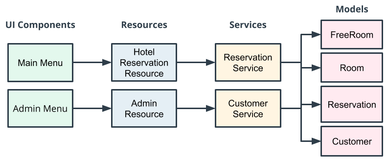

# **Hotel Reservation Application**

#項目要求
    在構建應用程序時，開發人員通常會收到關於應用程序應該如何工作以及應該做什麼的規範或一組要求。  
    此頁面提供酒店預訂應用程序所需的功能。
    
    如果您注意到這些要求的原因，記住和應用這些要求將是最容易的——例如:  
    一個要求是兩個人不能在同一天預訂同一個房間。
    對於任何不會讓用戶發瘋的功能性預訂應用程序來說，這一要求都是現實的要求！  
    
    注意：您無需記住此處的信息 — 相反，您需要在構建應用程序時參考這些要求。我們建議您打印此頁面或在新選項卡中打開它。  

##用戶場景
該應用程序提供了四種用戶場景：

* ###創建客戶帳戶  
    用戶需要先創建一個客戶帳戶，然後才能創建預訂。  

* ###正在尋找房間。  
    該應用程序應允許用戶根據提供的入住和退房日期搜索可用房間。  
    如果應用程序有指定日期範圍內的可用房間，則會顯示相應房間的列表供用戶選擇。

* ###訂房。  
    一旦用戶選擇了房間，該應用程序將允許他們預訂房間並創建預訂。

* ###查看預訂。  
    預訂房間後，該應用程序允許客戶查看所有預訂的列表。  

 
#管理方案
該應用程序提供了四種管理方案：

* 顯示所有客戶帳戶。
* 查看酒店的所有房間。
* 查看所有酒店預訂。
* 向酒店應用程序添加房間。

# 預訂房間 - 要求
該應用程序允許客戶預訂房間。以下是具體內容：

    避免相互衝突的保留。
    每個入住和退房日期範圍內只能由一名客戶預訂單間客房。
    搜索推薦的房間。
    如果客戶的日期範圍內沒有可用房間，則會執行搜索以顯示替代日期的推薦房間。
    推薦房間搜索將在原始入住和退房日期的基礎上增加 7 天，以查看酒店是否有空房，然後向客戶顯示推薦的房間/日期。

    示例：如果客戶搜索日期範圍為 1/1/2020 – 1/5/2020 並且所有房間都已預訂，
    系統將使用日期範圍 1/8/2020 – 1/12/2020 再次搜索推薦房間。
    如果沒有推薦的房間，系統將不會返回任何房間。

#房間要求
* ###房間費用
    客房將包含每晚的價格。  
    顯示房間時，付費房間將顯示每晚價格，免費房間將顯示“免費”或 0 美元的價格。  
* ###唯一的房間號  
    每個房間都有一個唯一的房間號，這意味著沒有兩個房間可以有相同的房間號。
* ###房型
    房間可以是單人或雙人（枚舉：SINGLE、DOUBLE）。  

#客戶要求
    該應用程序將具有客戶帳戶。每個賬戶有：
    
    客戶的獨特電子郵件。RegEx 用於檢查電子郵件的格式是否正確（即name@domain.com）。
    一個名字和姓氏。
    就本練習而言，電子郵件 RegEx 很簡單，可能無法涵蓋所有現實世界中的有效電子郵件。
    例如，“ name@domain.co.uk ”不會被上述 RegEx 接受，
    因為它確實以“.com”結尾。如果您想嘗試使您的 RegEx 更複雜，您可以——但這不是本項目所必需的。

#錯誤要求
    酒店預訂應用程序優雅地處理所有異常（包括用戶輸入），這意味著：
    
    沒有崩潰。
    應用程序不會根據用戶輸入崩潰。
    沒有未處理的異常。
    該應用程序具有try與catch被用於捕獲例外和塊提供給用戶的有用信息。沒有未處理的異常。  

